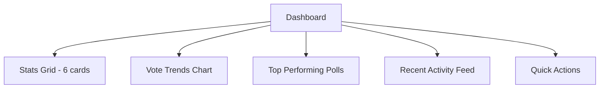

# Frontend Improvement Plan

## Current State Analysis

### Project Overview
- **Framework**: Next.js 16 with App Router
- **Styling**: Tailwind CSS with dark mode support
- **Pages**: Dashboard, Explore, Create Poll
- **State Management**: React Context + custom hooks

---

## Issues Identified

### 1. UI/UX Issues
- ❌ Inconsistent border radius (mix of ``, `rounded-2xl`, ``)
- ❌ No proper theme color palette in [`tailwind.config.ts`](frontend/tailwind.config.ts)
- ❌ [`Button.tsx`](frontend/components/ui/Button.tsx) uses undefined color tokens (`primary-600`, etc.)
- ❌ [`Card.tsx`](frontend/components/ui/Card.tsx) uses undefined utility classes (`glass`, `shadow-elevation-2`)
- ❌ Dashboard lacks proper charts/analytics visualization
- ❌ Sharp edges not consistently applied

### 2. Missing Features
- ❌ No poll editing functionality
- ❌ No poll results detailed view
- ❌ No search/filter functionality
- ❌ No poll categories or tags
- ❌ No user profile page
- ❌ No notifications system
- ❌ No poll sharing functionality
- ❌ No real-time WebSocket status indicator
- ❌ No poll results export
- ❌ No poll duplication/cloning

### 3. Edge Cases Not Handled
- ❌ Empty states not properly designed
- ❌ Error states need improvement
- ❌ Long titles/descriptions overflow
- ❌ No network offline handling
- ❌ No rate limiting feedback
- ❌ Race conditions in voting/liking
- ❌ No duplicate option validation

---

## Implementation Plan

### Phase 1: Design System Foundation

#### 1.1 Define Theme Colors & Sharp Edges
**Files to modify:**
- [`tailwind.config.ts`](frontend/tailwind.config.ts)
- [`globals.css`](frontend/app/globals.css)

**Changes:**
```typescript
// Proposed color palette
colors: {
  primary: { 50: '#f0f4ff', 100: '#e0e8ff', 500: '#6366f1', 600: '#4f46e5', 700: '#4338ca' },
  accent: { 50: '#fdf4ff', 500: '#a855f7', 600: '#9333ea' },
  success: { 500: '#22c55e', 600: '#16a34a' },
  warning: { 500: '#f59e0b', 600: '#d97706' },
  error: { 500: '#ef4444', 600: '#dc2626' },
}
```

**Sharp edges**: Replace all `rounded-*` with `rounded-none` or `` (2px)

#### 1.2 Fix UI Components
**Files to modify:**
- [`Button.tsx`](frontend/components/ui/Button.tsx) - Fix undefined color tokens
- [`Card.tsx`](frontend/components/ui/Card.tsx) - Fix undefined utility classes
- Create new [`Badge.tsx`](frontend/components/ui/Badge.tsx) component
- Create new [`Input.tsx`](frontend/components/ui/Input.tsx) component
- Create new [`Select.tsx`](frontend/components/ui/Select.tsx) component

---

### Phase 2: Dashboard Enhancement

#### 2.1 Add Charts & Analytics
**New Components:**
- [`PollChart.tsx`](frontend/components/charts/PollChart.tsx) - Bar/pie chart for poll results
- [`VoteTrendChart.tsx`](frontend/components/charts/VoteTrendChart.tsx) - Line chart for voting trends
- [`EngagementMetrics.tsx`](frontend/components/dashboard/EngagementMetrics.tsx) - Engagement cards

**Library**: Use `recharts` for charting

**Dashboard Layout Update:**


#### 2.2 Admin Features
- Poll management table with filters
- Bulk actions (close multiple polls)
- User activity monitoring
- Platform analytics overview

---

### Phase 3: Poll Features Enhancement

#### 3.1 Poll Editing
- Add edit mode for poll creator
- Edit title, description, options
- Add/remove options before closing

#### 3.2 Poll Results Detail View
- Full-screen results modal
- Export results as CSV/JSON
- Shareable results link
- Comparison view for multiple polls

#### 3.3 Search & Filter
- Search polls by title
- Filter by status (active/closed)
- Filter by date range
- Sort by votes, likes, recency

---

### Phase 4: Edge Cases & Error Handling

#### 4.1 Empty States
- Create [`EmptyState.tsx`](frontend/components/ui/EmptyState.tsx) component
- Design for each page:
  - Dashboard: No polls yet
  - Explore: No active polls
  - Search: No results found

#### 4.2 Error Boundaries
- Wrap pages in error boundary
- Create error fallback component
- Improve error messages

#### 4.3 Network Handling
- Offline indicator
- Retry mechanism for failed requests
- Optimistic updates with rollback

#### 4.4 Form Validation
- Duplicate option detection
- Character limits with counters
- Real-time validation feedback

---

### Phase 5: Real-time Features

#### 5.1 WebSocket Status Indicator
- Connection status badge
- Reconnect notifications
- Live vote counter

#### 5.2 Notifications
- New poll notifications
- Poll closing reminders
- Like/vote activity updates

---

## File Structure After Changes

```
frontend/
├── app/
│   └── (app)/
│       ├── dashboard/
│       │   └── page.tsx
│       ├── explore/
│       │   └── page.tsx
│       ├── create-poll/
│       │   └── page.tsx
│       ├── poll/
│       │   └── [id]/
│       │       └── page.tsx
│       └── profile/
│           └── page.tsx
├── components/
│   ├── ui/
│   │   ├── Button.tsx
│   │   ├── Card.tsx
│   │   ├── Badge.tsx
│   │   ├── Input.tsx
│   │   ├── Select.tsx
│   │   ├── EmptyState.tsx
│   │   └── ErrorFallback.tsx
│   ├── charts/
│   │   ├── PollChart.tsx
│   │   └── VoteTrendChart.tsx
│   ├── dashboard/
│   │   ├── StatsCard.tsx
│   │   ├── EngagementMetrics.tsx
│   │   └── RecentActivity.tsx
│   ├── polls/
│   │   ├── PollCard.tsx
│   │   ├── PollForm.tsx
│   │   ├── PollResults.tsx
│   │   └── PollEditForm.tsx
│   └── layout/
│       └── AppSidebar.tsx
├── hooks/
│   ├── usePolls.ts
│   ├── useSearch.ts
│   └── useRealtime.ts
└── lib/
    └── constants.ts
```

---

## Priority Matrix

| Priority | Task | Effort | Impact |
|----------|------|--------|--------|
| P0 | Fix UI component color tokens | Low | High |
| P0 | Fix Card component undefined classes | Low | High |
| P1 | Define theme colors in tailwind.config | Medium | High |
| P2 | Add charts to dashboard | Medium | High |
| P2 | Implement empty states | Low | Medium |
| P2 | Add error handling | Medium | High |
| P3 | Poll editing feature | High | Medium |
| P3 | Search & filter | Medium | Medium |
| P4 | User profile page | High | Low |
| P4 | Notifications system | High | Medium |

---

## Next Steps

1. **Approve this plan** - Confirm which phases to implement
2. **Phase 1 first** - Fix design system foundation
3. **Phase 2 next** - Dashboard enhancement with charts
4. **Phase 3+** - Based on feedback and priorities

---

*Plan last updated: 2026-01-28*
